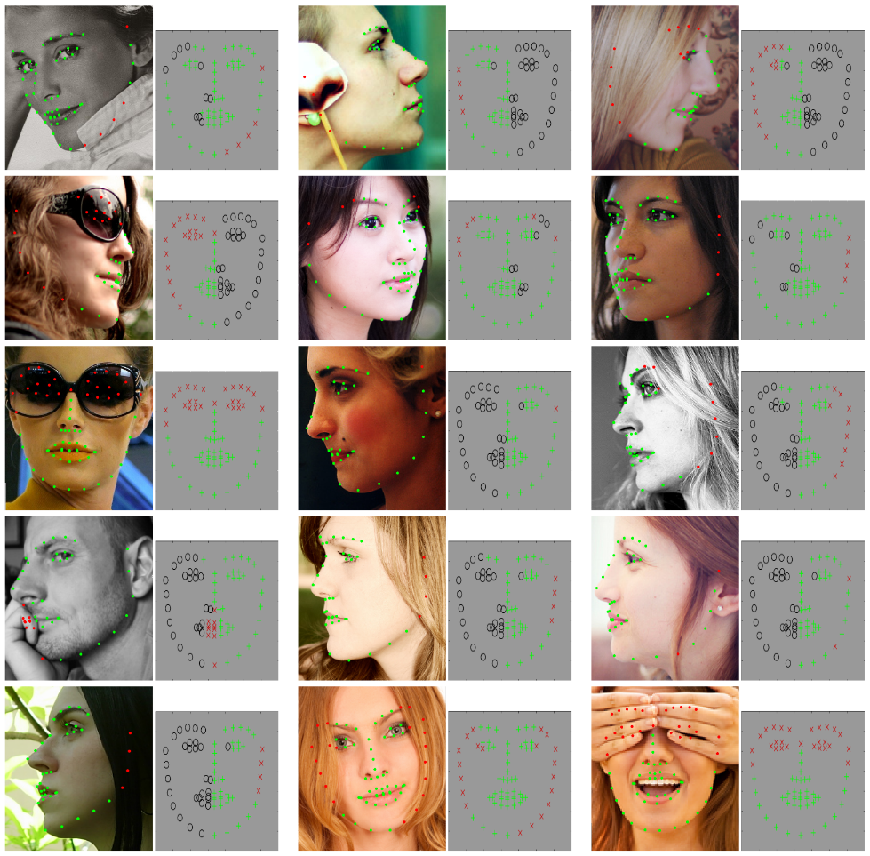

# MERL-RAV Dataset
<p align="center"></p>
<p align="center"></p>

MERL-RAV (MERL Reannotation of AFLW with Visibility) dataset contains over 19,000 face images in a full range of head poses. Each face is manually labeled with the ground-truth locations of 68 landmarks, with the additional information of whether each landmark is unoccluded, self-occluded (due to extreme head poses), or externally occluded.

Please cite the following paper if you use this dataset in your research:
```
@inproceedings{kumar2020luvli,
  title={LUVLi Face Alignment: Estimating Landmarks' Location, Uncertainty, and Visibility Likelihood},
  author={Kumar, Abhinav and Marks, Tim K and Mou, Wenxuan and Wang, Ye and Jones, Michael and Cherian, Anoop and Koike-Akino, Toshiaki and Liu, Xiaoming and Feng, Chen},
  booktitle={CVPR},
  year={2020}
}
```
Please also consider citing the original [AFLW dataset](https://www.tugraz.at/institute/icg/research/team-bischof/lrs/downloads/aflw/)
 as well.

### Instructions
Download this repo and unzip it. Move to the project directory.
```bash
cd $PROJECT_DIR
```

Then, download the AFLW dataset by following the instructions [here](https://www.tugraz.at/institute/icg/research/team-bischof/lrs/downloads/aflw/)

The project directory should look like this
```bash
 |--merl_rav_labels
 |        |-- frontal
 |        |      |--testset
 |        |      |--trainset
 |        |
 |        |-- left 
 |        |      |--testset
 |        |      |--trainset
 |        |
 |        |-- lefthalf
 |        |      |--testset
 |        |      |--trainset
 |        |
 |        |-- right
 |        |      |--testset
 |        |      |--trainset
 |        |
 |        |-- righthalf
 |               |--testset
 |               |--trainset
 |
 |
 |--aflw
 |    |--flickr
 |         |--0
 |         |--2
 |         |--3
 |
 |--common_functions.py
 |--organize_merl_rav_using_aflw_and_our_labels.py
```
If your ```aflw``` folder is located elsewhere set the path in ```input_folder``` variable of the file ```organize_merl_rav_using_aflw_and_our_labels.py```

Next execute the following command
```bash
python organize_merl_rav_using_aflw_and_our_labels.py
```

The script goes through the sub-folders of the ```merl_rav_labels``` folder and then find the corresponding image from the ```aflw``` folder. It will then create a folder named ```merl_rav_organized``` in the same project directory. This folder will have the following sub-folders

```bash
 |--merl_rav_organized
 |        |-- frontal
 |        |      |--testset
 |        |      |--trainset
 |        |
 |        |-- left 
 |        |      |--testset
 |        |      |--trainset
 |        |
 |        |-- lefthalf
 |        |      |--testset
 |        |      |--trainset
 |        |
 |        |-- right
 |        |      |--testset
 |        |      |--trainset
 |        |
 |        |-- righthalf
 |               |--testset
 |               |--trainset
 |
 |--merl_rav_labels
 |--aflw
 |--common_functions.py
 |--organize_merl_rav_using_aflw_and_our_labels.py
```
Each of the ```testset``` and ```trainset``` sub-folders in ```merl_rav_organized``` folder will have the images as well as labels. The basename of the image and the ground truth labels are the same, they only differ in the name of the extension. The labels have pts extension while images have the jpg extension.

eg. The image with name ```image03891.jpg``` has the labels ```image03891.pts```

### Format of the labellings
We follow the 68 point labelling scheme of the [300-W](https://ibug.doc.ic.ac.uk/resources/300-W/) and Multi-PIE dataset.

As explained before, our labellings distinguish between three types of landmarks

| Occlusion type       |  Meaning  | Coordinate labels| Pixel Location | 
| ---------------------| ----------| -----------------|----------------|
| Unoccluded           | Landmark is clearly visible  |  Positive coordinates ```(x, y)```| ```(x, y)``` |
| Externallly Occluded |  Landmark is occluded by an external object such as the subject’s hair, hand, glasses, a microphone, etc.  |  Negative coordinates ```(-x, -y)``` | ```(x, y)``` |
| Self-Occluded        | Landmark is not visible because it is occluded by another part of the subject’s face | ```(-1, -1)``` | Not estimated.|

As an example, consider a small snippet of one of the labels file
```bash
version: 1
n_points:  68                                # <--- MERL-RAV uses a 68-landmark markup system.
{
-1 -1                                        # <--- Landmarks 1, 2, and 3 are self-occluded.
-1 -1
-1 -1
-1443.5399999999997 -474.31999999999994      # <--- Landmark 4 is externally occluded. Its estimated location is (1443.5399999999997, 474.31999999999994)
-1420.0199999999998 -535.0799999999999
-1388.6599999999996 -603.6799999999998
1382.7799999999997 680.1199999999999         # <--- Landmark 7 is unoccluded. Its location is (1382.7799999999997, 680.1199999999999).
1372.9799999999998 758.5199999999999
...
}
```

### Multiple Faces in a Single Image
One image from the datasset could contain multiple faces. When that happens we used ```_1``` to index which of the faces in the image is being labeled. The image remains the same but the labels of two faces would be different.

eg. ```merl_rav_labels/frontal/trainset/image20991_1.pts``` and  ```merl_rav_labels/frontal/trainset/image20991_2.pts``` are labels of two faces present in a single AFLW image ```image20991.jpg```. 

Our script automatically duplicates this AFLW image ```image20991.jpg``` and appends ```_1``` and ```_2``` to produce ```merl_rav_organized/frontal/trainset/image20991_1.jpg``` and ```merl_rav_labels/frontal/trainset/image20991_2.jpg```

<br/>

## Contact

In case of any queries, feel free to drop an email to 
[Abhinav Kumar](https://sites.google.com/view/abhinavkumar/) (```abhinav3663@gmail.com```) or [Tim Marks](http://www.merl.com/people/tmarks) (```tmarks@merl.com```)
